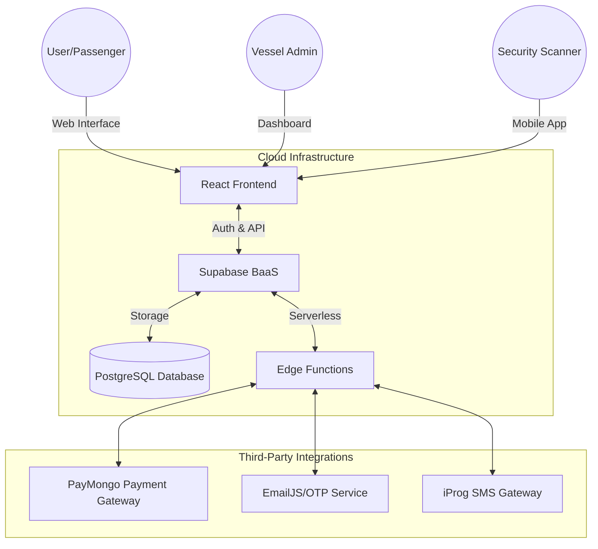

# CHAPTER 3: METHODOLOGY

This chapter presents the research methodology, system design, and technical framework used in the development of **SmartPort: An Integrated Port Management and Ticket Booking System**. It details the architectural decisions, database modeling, and security measures implemented to ensure a robust and scalable solution.

## 3.1 Research Design
The study utilizes the **Agile Development Methodology**, specifically the **Scrum Framework**, to facilitate an iterative and incremental development process. This approach was selected to allow for flexibility in addressing evolving user requirements and to ensure continuous quality improvement through frequent testing cycles.

The development lifecycle is divided into four primary phases:
1.  **Requirement Analysis**: Identification of core functionalities for passengers, vessel administrators, and port security scanners.
2.  **System Design**: Drafting of architectural diagrams, database schemas, and user interface mockups.
3.  **Iterative Development**: Coding of modular components (frontend and backend) using React and Supabase.
4.  **Verification and Testing**: Rigorous testing of payment integrations, QR scanning reliability, and identity verification accuracy.

## 3.2 System Architecture
SmartPort follows a **Cloud-Based Client-Server Architecture**, leveraging Backend-as-a-Service (BaaS) for real-time data synchronization and scalability.

## 3.3 System Requirements

### 3.3.1 Hardware Requirements
*   **Passenger Device**: Any modern smartphone or personal computer with an active internet connection.
*   **Scanner Device**: Mobile device with a high-resolution camera (min. 8MP) for QR code and ID capture.
*   **Admin Console**: Personal computer with at least 8GB RAM for managing heavy data manifest logs.

### 3.3.2 Software Requirements
*   **Frontend**: React.js 18 with Vite build tool.
*   **Styling**: Tailwind CSS for responsive and premium UI design.
*   **Backend**: Supabase (PostgreSQL, Auth, and Storage).
*   **State Management**: React Query (TanStack) for efficient data fetching and caching.

## 3.4 Database Design
The system utilizes a relational database structure designed to maintain data integrity across multiple vessels and user roles.

### 3.4.1 Entity Relationship Overview
The core entities include:
*   **Ships**: Stores vessel details, routes, and scheduling.
*   **Seats/Bunks**: Tracks real-time availability of accommodations.
*   **Bookings**: Manages passenger details, payment status, and verification scores.
*   **Staff**: Manages role-based access for Admins, Super Admins, and Scanners.
*   **System Logs**: Maintains an audit trail of all administrative actions.

### 3.4.2 Data Dictionary (Key Tables)

| Table Name | Description | Key Fields |
| :--- | :--- | :--- |
| `ships` | Vessel information | `id`, `name`, `route`, `price`, `total_seats`, `is_active` |
| `bookings` | Transactional data | `id`, `passenger_name`, `status`, `qr_code`, `id_verified` |
| `seats` | Inventory management | `id`, `ship_id`, `label`, `type`, `status` |
| `staff` | User accounts | `id`, `name`, `role`, `ship_id` (assigned) |

## 3.5 Operational Data Flow
The data flow within SmartPort is designed to ensure a seamless transition from booking to boarding.

1.  **Booking Phase**: Passenger selects a route, vessel, and seat.
2.  **Verification Phase**: If a discount is requested (Student/Senior/PWD), the system triggers the **Identity Capture Module** to upload a document for Admin approval.
3.  **Payment Phase**: Upon verification, the **PayMongo Integration** processes the transaction securely.
4.  **Issuance Phase**: A unique **QR-encoded Digital Ticket** is generated and stored in the database.
5.  **Boarding Phase**: The **Scanner Module** decodes the QR code and validates the trip date and vessel ID in real-time.

## 3.6 Security and Verification
To protect user data and prevent fraudulent bookings, several security layers are implemented:
*   **Identity Verification**: Uses a dedicated `BiometricScanner` component to capture high-quality images of government IDs.
*   **OTP Verification**: Multi-factor authentication via EmailJS or iProg SMS for login security.
*   **Data Encryption**: AES-256 encryption for sensitive third-party API keys stored in the database.
*   **Role-Based Access Control (RBAC)**: Strict permission boundaries ensuring Scanners cannot access financial data and Admins only manage their assigned vessels.

## 3.7 Development Environment
The development of SmartPort utilized a modern toolset to ensure efficiency, code quality, and seamless collaboration.

### 3.7.1 Integrated Development Environment (IDE)
In the development of SmartPort, **Visual Studio Code (VS Code)** served as the primary code editor for the entire development team. Extensions for TypeScript, React, Tailwind CSS, ESLint (code quality), and Prettier (code formatting) were installed within VS Code to enforce consistent coding standards across the codebase. The built-in Git integration was used daily for committing changes, managing feature branches, and resolving merge conflicts across the team. VS Code's integrated terminal allowed developers to run Vite's development server, execute Supabase CLI commands for local database migrations, and manage npm packages without switching between applications.

### 3.7.2 AI-Assisted Development
The development process was significantly accelerated through the use of **Antigravity**, a powerful agentic AI coding assistant. Antigravity was integrated into the daily workflow in several key capacities:

*   **Real-time Debugging**: Antigravity served as the first line of defense against complex runtime errors. By analyzing stack traces and log outputs, it provided immediate root-cause analysis and proposed surgical fixes for issues ranging from state synchronization in React to database constraint violations in Supabase.
*   **Intelligent Refactoring**: During the evolution of the project, Antigravity was used to refactor legacy code blocks into modern, modular components. This included migrating prop-drilling patterns to centralized state management using React Query and streamlining complex UI logic in components like the `AdminDashboard`.
*   **Rapid Prototyping and Boilerplate**: The assistant generated initial structures for new features, such as the `BiometricScanner` and `PayMongo` integration modules, allowing the development team to focus on high-level business logic rather than repetitive boilerplate code.
*   **Automated Browser Testing**: Antigravity utilized its integrated browser environment to perform end-to-end verification of user flows, such as the ticket booking process and administrative verification steps, ensuring that UI updates did not introduce regressions.
*   **Technical Documentation**: The assistant facilitated the creation of this methodology chapter and other technical artifacts by cross-referencing the actual implementation details within the codebase, ensuring documentation accuracy.

## 3.8 Summary
Chapter 3 outlined the systematic approach taken to develop SmartPort, ranging from the Agile research design to the specific technical architecture and development tools. By leveraging a combination of modern frameworks (React and Supabase) and advanced development tools (VS Code and Antigravity), the project established a secure, scalable, and well-documented foundation for port management and digital ticketing.
